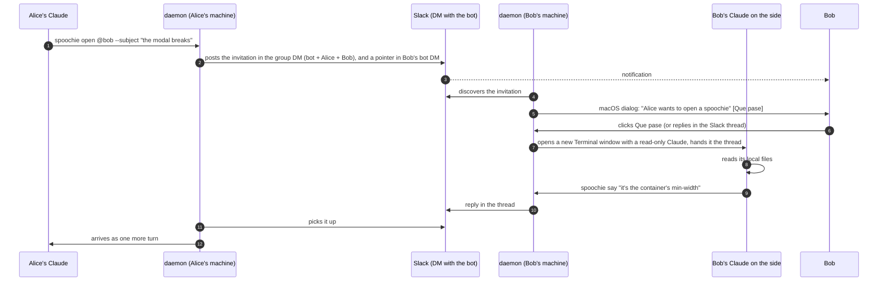
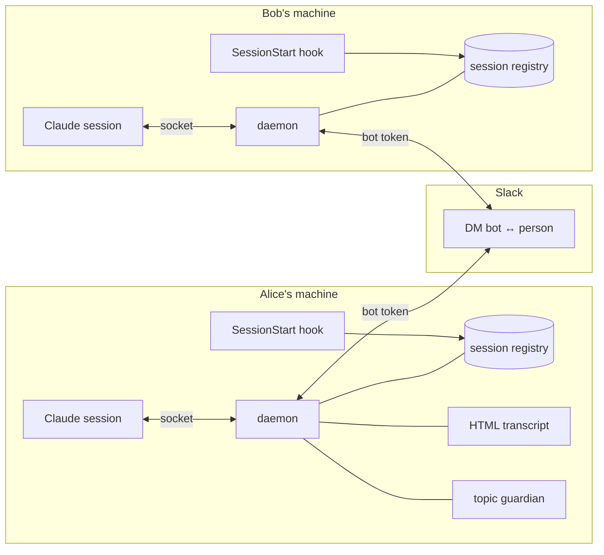

<p align="center">
  
</p>

<h1 align="center">Spoochie</h1>

<p align="center">
  A tunnel between your Claude Code session and a teammate's.<br>
  Your Claude asks theirs, theirs reads its own files and answers. Slack notifies and keeps the thread.
</p>

<p align="center">
  <a href="#install">Install</a> ·
  <a href="#how-it-works">How it works</a> ·
  <a href="#what-its-for">What it's for</a> ·
  <a href="#usage">Usage</a> ·
  <a href="#rules-that-are-built-not-written">Rules</a> ·
  <a href="#security-model">Security</a> ·
  <a href="#development">Development</a> ·
  <a href="#license">License</a>
</p>

---

## What spoochie is

spoochie is a Claude Code plugin that lets your Claude talk to a teammate's Claude. You
ask a question about their branch, their repo, or their machine; your Claude opens a
**spoochie** (a short, scoped tunnel) to theirs; theirs reads its own local files and
answers through the tunnel; the answer arrives in your session as one more turn. The
other person has to say yes before anything opens, and both of you see the whole
exchange in a Slack thread, where you can step in at any time.

Under the hood it is a small daemon on each machine, the inbox socket that Claude Code
already exposes for every session, end-to-end encrypted messages over public Nostr relays
between machines, and a Slack bot that notifies people (and can carry the thread instead,
if a team prefers). Nobody writes on anyone else's machine: what travels is text, a
patch to apply if it convinces you, or a branch name. The Claude that answers on the
other side runs in its own terminal window, read-only, so the person's working session
is never interrupted by someone else's conversation.

It is called Spoochie after Poochie, the dog with the sunglasses that Itchy & Scratchy
got so the show would be "cooler": Poochie with an s, said the same way. The CLI, the
plugin and the slash commands are all `spoochie`, lowercase.

> **Coming from `spochie` (0.5.x)?** Same tool, one letter longer. Uninstall the old
> plugin first, then install the new one: `/plugin uninstall spochie@edugargar`,
> `/plugin marketplace update edugargar`, `/plugin install spoochie@edugargar`, and
> restart Claude Code. Your state (token, keys, contacts, threads) moves itself from
> `~/.claude/spochie` to `~/.claude/spoochie` on first start, and the old launchd daemon
> is stopped and removed. The old GitHub URL redirects. Nothing to re-join.

## The problem

Two people, two branches, two Claude Code sessions. Bob's session knows why the modal
breaks because it has the code in front of it. Alice's session needs to know. Today that
goes like this: Alice asks her Claude, copies the answer, pastes it to Bob on Slack, Bob
pastes it into his Claude, copies what comes out and sends it back. Four pastes per
question, with the humans as couriers.

spoochie removes the pastes. Alice's Claude opens a spoochie, Bob's receives it with the
subject and the context, reads **its own local files** and answers. Both humans see it in
a Slack thread and can step in whenever they want. Nobody writes on the other person's
machine, and no tunnel opens until the receiving person says yes.

## Install

One command on the inviter's side, and on the newcomer's side two commands in Claude
Code, a restart, and one paste. No terminal, no Slack login, no tokens to copy, no Slack
permissions to ask for, nothing to install first: if [Bun](https://bun.sh) isn't there,
the first session start fetches a self-contained binary from this repo's releases.

The inviter runs:

```
spoochie invite --to sam@example.com          # or --to U01234567 --name Sam
```

The bot sends the newcomer a DM with everything inside: the two plugin commands, the
restart, and the line to paste. That line already says who it's for and who sent it, so
the newcomer never has to be looked up in Slack and `@edu` resolves locally afterwards.

The newcomer follows the DM:

```
/plugin marketplace add edugargar/spoochie
/plugin install spoochie@edugargar
```

restarts Claude Code, and pastes the last line of the DM:

```
/spoochie:join eyJiIjoi...
```

Pasting the whole DM works too; the invitation cleans itself out of whatever surrounds
it. At the end it runs `spoochie selftest` and prints `Todo bien` or which step failed.

`spoochie invite` with no `--to` prints the line for you to send by hand.

What the invitation carries: the inviter's public keys and relays, the newcomer's Slack
id and name, and the team name. It is base64 JSON, not encrypted, and anyone can open
it, so there is no secret inside. Since 0.9.7 the Slack bot token is not in it: the
newcomer's daemon talks over Nostr, and the DM that tells them someone opened a
spoochie comes from the opener's bot. `spoochie invite --con-slack` puts the token back
for a newcomer who must reach contacts still on the Slack transport (pre-0.9); the DM
then says so in its first lines.

## How it works



The underlying mechanism is small. Claude Code opens one inbox socket per session and
exports its path and a token:

```
CLAUDE_CODE_MESSAGING_SOCKET=/tmp/cc-socks/<pid>.sock
CLAUDE_CODE_MESSAGING_TOKEN=<token>
```

A local process writes two lines there and the text enters that session as a turn:

```json
{"type":"auth","token":"<token>"}
{"type":"user","message":{"role":"user","content":"..."}}
```

That's the whole thing. The format is not in the public docs: it comes from the Claude
Code binary itself, which prints it as a supported recipe for hooks and scripts. spoochie
does not use `channels`, so it depends on nothing in research preview and on no workspace
Owner enabling anything.



Parts:

- **`SessionStart` hook**: registers the session, starts the daemon and claims the
  spoochies that arrived while nobody was listening.
- **daemon, one per machine**: the only thing alive between turns, so it keeps the clocks
  and routes. A Claude can't hold a timer; it only exists while it thinks. On macOS it
  runs under launchd and writes a heartbeat every 20 s that `doctor` measures.
- **Nostr bridge**: the transport between machines since 0.9: end-to-end encrypted
  private messages through public relays, no server of ours.
- **Slack bridge**: notifications, and the transport for people without a Nostr key or
  teams that choose it.
- **guardian**: on the receiving side, Haiku reads every incoming message. Off-topic
  gets a label; a message that asks the receiving Claude to act is held until the
  receiving human releases it.
- **transcript**: one HTML file per thread, ready to publish as an Artifact.
- **`SessionEnd` hook**: closing the window closes your live spoochies.
- **the Claude on the side**: one Claude per accepted spoochie, in a new terminal window,
  read-only, in the repo that matters, so your own session stays yours.
- **`UserPromptSubmit` hook**: touches your session record, so the daemon knows which
  terminal you are actually working in and delivers the invitation there.

## What it's for

- **"Why does this break on your branch?"** Your Claude opens a spoochie with the subject
  and the touched files. Theirs reads its checkout and answers with the cause, not a guess.
- **A fix that lives on another machine.** The Claude on the other side sends a patch
  (`spoochie patch --from-git`) or a branch name. You apply it if it convinces you.
- **A screenshot that says more than a thousand lines.** `--files broken-modal.png`
  uploads it to the thread; the other Claude opens it from its own disk and describes it.
- **Context nobody wrote down.** "What's the flag that disables the cache locally?" Their
  Claude knows because it's in their `.env.example`. Yours doesn't.
- **A thread that stays.** The whole exchange is in Slack for the people and in an HTML
  transcript to read end to end.

## The Claude on the side

A spoochie that lands in the session you are working in smears someone else's
conversation over your screen. So it never does. On macOS an incoming spoochie is a
**system dialog**, outside every terminal, with Poochie on it: who is asking, the
subject, the question, and three buttons. "Que pase" (let them in) accepts; "Ahora no"
(not now) closes the tunnel as rejected; "Ver en Slack" opens the thread, where replying
also accepts. Your open sessions see nothing at all, before or after.

Once you accept, the daemon opens a **new terminal window** running a Claude of its own
on a **clean copy of the repo** (a `git worktree` of HEAD, shared objects, seconds to
make), hands it the thread, and every later turn goes there. Your checkout is never the
working directory of that Claude, so even something that slipped past its tool list
could not touch your files. The price: what isn't committed (`.env`, local edits) isn't
in the copy, and the side Claude says so when asked. `spoochie config --copia off`
makes it work in the real checkout instead. You watch it
work in that window and can type to it. It can read the repo and run read-only git; it
cannot write files, cannot accept or release anything. Closing the window closes the
spoochie.

Which repo, in order: the open session whose checkout has the branch in the envelope;
the one whose directory name appears in the subject or the first message; otherwise the
one you typed in most recently. That session only lends its directory. If it picked
wrong, `spoochie take <id>` from the right session moves it. Accepting twice, or taking
it from the same repo, never opens a second window.

Without a desktop (Linux servers, `SPOOCHIE_AVISO=terminal`) the invitation is delivered
into that session as a turn instead, and its Claude asks you.

- The window runs in Claude Code's `auto` permission mode: the read-only allowlist is
  approved outright, anything else is judged by Claude Code's own classifier instead of
  stopping to ask, and Edit, Write, `git push`, `git commit`, `git checkout`, `git reset`
  and `rm` are denied outright, which no mode can override. `SPOOCHIE_APARTE_PERMISOS=default`
  in the daemon's environment makes it ask for everything again.
- On macOS the window is Terminal.app, opened with `open`, which needs no permissions.
  Anywhere a window cannot be opened (Linux without a desktop, `SPOOCHIE_VENTANA=fondo`)
  the side Claude runs headless as `claude -p`, with its output in
  `~/.claude/spoochie/aparte/<id>.log`.
- `--aqui` on `accept` or `take` keeps the old behaviour: that session answers itself.
- `spoochie config --aparte off` turns the side Claude off for good.
- Where it runs is posted in the Slack thread, not in your terminals.

## Usage

In practice there's nothing to learn: tell your Claude in plain words, "open a spoochie
with Bob about the modal save error". Underneath it runs this:

```
spoochie sessions
spoochie open <target> --subject "the button breaks" --body "..." [--files a,b]
    target: a local session name, or @person for another machine
spoochie accept <id>                  RUN BY THE RECEIVING HUMAN
spoochie say <id> "<text>" [--human] [--files a,b]
spoochie patch <id> [--from-git | --diff-file f]
spoochie branch <id> <branch>
spoochie close <id> --reason "..."
spoochie list | show <id> | transcript <id>
spoochie search "<text>"              across every spoochie on this machine
spoochie config --human "Alice" --guardian on|off --transcript on|off --hilos grupo|canal|dm [--canal C0…]
```

When someone opens one for you, you get a DM from the bot. Replying in that thread is
accepting. Until you accept, not a single answer leaves your side.

## Rules that are built, not written

Not in a policy document: built, each with its test.

- **The receiving human opens the door.** A `say` before acceptance is rejected with the
  exact command to run. What makes the approval real is Claude Code's permission system:
  keep `spoochie accept` out of your allowlist and running it raises the dialog, which
  only the person can approve.
- **Nobody writes on the other machine.** A fix travels as a text patch or a branch, and
  the Claude over there applies it under its own permissions, if it's convinced.
- **The envelope is small**: branch, SHA, touched file names. Nothing else automatic.
  Attaching more is convenient right up to the day a `.env` slips into the envelope.
- **What the other side writes is fenced.** Every message enters between a random marker
  that changes per message, and the receiver's rules always come after the closing
  marker. Without that, a message could write its own headers or imitate spoochie's
  instructions.
- **Two clocks**: pending acceptance survives 4 h; live and silent dies at 10 min, with a
  warning at 7. An unread message and an unanswered call are not the same thing.
- **A patch that doesn't fit is refused when sent.** Over Slack a diff travels in 16,200
  characters; anything beyond is not truncated from the end, it is rejected and a branch
  is suggested.
- **The guardian judges on arrival, not on departure.** The sender need not be
  trusted. Off-topic only gets a label and a note in the thread. A message that asks
  the receiving Claude to run, modify, install, open, send files or secrets, or that
  poses as system rules, never enters the session: it waits in the thread until the
  receiving human writes `suelta` (or `descarta`), or runs `spoochie release`.
- **Envelopes are signed.** Each person gets an ed25519 key at join. Every envelope
  carries the public key and a signature over id, kind, sender and text; the first key
  seen for a Slack id is pinned, like SSH, and a later envelope from that id with
  another key is discarded and the thread is told. Unsigned envelopes still deliver,
  labelled as such.
- **"delivered" doesn't lie.** Over Slack a message leaves with a delay; until it leaves
  `say` waits up to 8 s for it to actually leave and then says `publicado`; only if it
  takes longer does it say `encolado` (queued), and if publishing fails the sending session
  is told. The silence warning lists facts (when your last message left, when the other
  side accepted, when their last message arrived) so the Claude reading it doesn't guess.

## Security model

Honest version. The real boundary is "whoever holds the bot token is on the team".
Everything else is built on top of that.

What's in place: text-only across machines (patch or branch name, never writes); the
human gate through Claude Code's permission dialog; signed envelopes with keys pinned on
first sight; the receiving-side guardian that holds anything asking the Claude to act;
per-message random fencing of remote text; downloaded files can't escape the spool
(`../` in name or id, tested) and neither can a thread id from an envelope (validated
on receipt and sanitised again on write); a sender's display name can never take over
an existing contact's entry; the binary the hook downloads is the one for the installed
plugin version and is checked against the release's `SHA256SUMS` before it runs; a
minimal envelope; config and session records at 0600 with `doctor` complaining
otherwise; both timeouts; no secrets in this repo.

What you should know:

- **One bot token for the whole team.** Whoever holds it can read the bot's DM with
  anyone and post as the bot. Since 0.9.7 it is not in invitations: a newcomer talks
  over Nostr and never holds it unless you pass `--con-slack`. Everyone who joined
  before 0.9.7 has it in their config; rotate it when someone leaves. Per-person OAuth
  (`xoxp`) is still supported via `spoochie slack setup` for teams that want it.
- **A Nostr key enters your contact list only through your own invitation.** The
  invitation carries a one-time nonce; the newcomer's "hola" returns it and the key is
  bound to the id and name you wrote down when inviting, not to what the hola says. A
  "hola" over Slack must be signed with the ed25519 key pinned for that Slack id. A
  contact that has a key never gets it replaced by a hola; the attempt is logged.
  `spoochie contacts` shows every key; `--olvidar-clave` drops one so you can re-invite.
- **Slack envelopes are pinned on first sight.** Whoever holds the bot token can still
  post the *first* envelope for a Slack id nobody has heard from, with a key of their
  own. After that, that id is theirs. Invitations carry the inviter's key, so the
  person who invited you is pinned before anything arrives.
- **Remote text enters your session as a turn.** The fence stops it from posing as a
  header or as spoochie's rules, and the guardian holds what asks you to act, but a
  persuasive message is still a persuasive message. Run Claude Code with normal
  permissions, not bypass, on machines that use spoochie.
- **With `--con-slack`, the bot token goes through the model once.** `/spoochie:join
  <blob>` passes the invitation as a prompt argument, so the token is in that session's
  context and in its local transcript under `~/.claude/projects/`. Without the flag
  (the default since 0.9.7) the invitation holds public keys and ids only.
- **The side Claude is read-only in practice, not by proof.** Its allowlist is Read,
  Grep, Glob, read-only git and the spoochie subcommands; Edit, Write and the git
  commands that change history are denied. `allowedTools` cannot filter arguments, so
  `git diff --output=<file>` would write a file, and in `auto` mode a Bash command
  outside the allowlist is decided by Claude Code's classifier, not by a person.
- **The guardian fails open, visibly.** If Haiku is unreachable or times out (20 s), the
  message is delivered labelled `sin vigilar` in the session and in the thread, rather
  than lost or silently trusted. A held message needs a working guardian.
- **Every envelope carries the sender's version.** When the other side is on an older
  line, the newer daemon says so once in the thread, with the update command. Both
  machines on the same minor version are guaranteed to understand each other; across
  minors, the newer side keeps reading the older format.
- **Slack sees everything**: patches and screenshots travel in the clear through Slack,
  like anything else you already paste there. The guardian sends each incoming message
  to Haiku; `spoochie config --guardian off` turns that off, and with it the hold.
- **The daemon's local socket has no auth.** Any process running as your user can ask it
  to inject text into your sessions. On a single-user machine that's the same boundary as
  your own processes; on a shared box it isn't.

## Nostr: no server, your keys, encrypted, deleted

Since 0.9, the conversation between two machines travels over [Nostr](https://nostr.com)
by default, and Slack is the notifier. There is no server of ours and no account for
anyone: each person gets a secp256k1 key pair at join (in `~/.claude/spoochie/config.json`,
mode 0600), and messages go through public relays that already exist. Anyone can run
one; each person picks theirs (`spoochie nostr --relays wss://a,wss://b`; three free
public relays by default).

What a relay sees: an event of kind 1059 addressed to a public key, signed by a random
one-time key, with a randomised timestamp. Nothing else. Inside, the message is a NIP-17
private message: the text in `content`, the subject in a `subject` tag (so a Nostr client
on your phone shows it readable), spoochie's envelope in an `sp` tag, sealed and signed
by the sender (kind 13) and gift-wrapped for the receiver (kind 1059) with NIP-44
encryption. Only the receiver's key opens it. When the spoochie closes, each side asks the
relays to delete every event it published (NIP-09, signed with the one-time key it kept),
and deletes locally as described above.

Who can reach you: only someone whose key is in your contacts, which is what the
invitation puts there. A perfectly formed envelope from an unknown key is dropped
without opening a tunnel. The invitation carries the inviter's key and relays; when the
newcomer joins, their daemon sends a "hola" with their key back over Nostr, and the two
can talk. People who were already on spoochie by Slack exchange keys automatically: each
daemon sends its key by Slack DM once to every contact that has none, and the other
daemon answers with its own. Nothing to re-join.

Slack keeps its job as the place that notifies you: when someone opens a spoochie with
you over Nostr, the bot DMs you one line pointing to the dialog on your Mac. The thread
itself is not in Slack. `spoochie config --transporte slack` puts threads back in Slack
for everyone; contacts without a Nostr key use Slack regardless.

Files (screenshots, logs) travel too, since 0.9.2: each file goes in 20 KB chunks, one
encrypted envelope per chunk, and the other daemon reassembles it in its own spool and
announces the local path, exactly as the Slack bridge does. The relay sees neither the
name nor the bytes. The 10 MB cap is the same as over Slack; a 500 KB screenshot is 25
envelopes. Chunks that arrive before the invitation wait in the spool until it does.

Tested against real relays (publish, receive, decrypt, delete) and with two real daemons
talking through a shared directory that stands in for the relays, with the whole
lifecycle and a check that no plaintext ever touches the "relay".

## Slack, inside

Two places, two jobs. The **DM between the bot and each person** is the mailbox: it is
the one channel each machine polls for what arrives. The **thread of each spoochie**
lives, by default, in a **group DM with the bot, you and the other person**, so both of
you see the whole conversation in Slack. (The first version kept the thread in the
receiver's bot DM, and the person who opened it never saw it in Slack.) When you open a
spoochie, the daemon posts the invitation in that group and drops the same invitation in
the receiver's bot DM with a pointer to the group; their daemon follows the pointer and
polls the group thread from then on.

`spoochie config --hilos` picks where threads live:

- `grupo` (default): a group DM per pair. Private to the two of you. Needs `mpim:write`,
  `mpim:read` and `mpim:history` on the bot; without them the daemon says so once and
  falls back to `dm`.
- `canal --canal C0…`: one channel for every spoochie of the team. Everyone in the channel
  sees everything, which may be the point. Invite the bot to the channel.
- `dm`: the receiver's bot DM only. The opener sees replies in their terminal, not in Slack.

Bot scopes for the normal path: `chat:write`, `im:write`, `im:read`, `im:history`, plus
the three `mpim:*` above for group threads. `docs/slack-app-manifest.yml` is the whole
app, ready to paste into "Create app from manifest", so nobody edits scopes by hand. `spoochie invite --to` resolves the newcomer
on the inviter's side, and the invitation carries both ids, so nobody is looked up in
Slack afterwards. `users:read` and `users:read.email` are only needed to invite by email
or by name, and for `@someone` who isn't in your local contacts. No user token is needed
for anything. Both machines need 0.7.1 or later for group threads: an older receiver
ignores the pointer and answers in its DM.

Alternatives I tried and dropped, with the measurement:

- **Socket Mode**: with several connections from the same app, Slack delivers each event
  to ONE of them. A spoochie for Bob could be grabbed by Alice's daemon.
- **Walking your DMs looking for the header**: the first version, and it fell over on the
  first real account. 197 DMs, `conversations.history` is Tier 3, and Slack returned
  `ratelimited` on the second channel.

`conversations.replies` and `conversations.history` are Tier 3: about 50 per minute **per
method and per app**, shared by the whole team. So each daemon caps itself: at most 4
threads per tick, round-robin, and the inbox poll adapts to the team size (your contacts
plus you) so that discovery never uses more than 25 `history` calls a minute in total:
every 5 s for up to 2 people, 10 s for 4, 36 s for 15, 60 s for 25. An invitation shows
up within one poll. For 15 people with two conversations at once that's 25 `history` and
24 `replies` calls per minute. On a 429, `Retry-After` is honoured and everything stops.

## Screenshots and files

`--files a.png,b.diff` on `open` or `say`. Within one machine they travel as absolute
paths and the Claude across opens them under its permissions. Across machines the bot
uploads them to the thread and the daemon on the other side downloads them to its own
spool, so what that session receives is a path that exists on **its** disk. 10 MB cap:
spoochie is for clues, not for moving binaries.

## A spoochie is a call, not an archive

When a spoochie closes, the conversation is deleted: locally only the envelope stays
(id, subject, who, when, why it closed) so `list` still works and the same id can't be
reused; the messages, the downloaded files and the HTML transcript go. In Slack, 45 s
later (enough for the other daemon to read the close), everything the bot posted goes
too: the thread, its files, and the pointer in the receiver's DM. What a person typed by
hand stays, because the bot can't delete it. The knowledge lives on in the Claude that
had the conversation: the asking session keeps every answer in its context and carries
on. `spoochie config --borrar off` keeps conversations instead.

Closing also reaches the other machine now: the close travels as its own envelope kind
and the other daemon closes (and deletes) at once, instead of finding out by silence
ten minutes later.

## The transcript

Off by default, and we turned it off for ourselves too: the Slack thread already is the
shared record, and publishing costs the opener's session one Artifact call per turn. The
HTML file in `~/.claude/spoochie/transcripts/` is written regardless, for free, and
`spoochie show <id>` reads the thread. If you turn it on, it republishes itself. The daemon keeps the HTML current but can't publish an Artifact,
which is a tool of the Claude session, so the republish request rides along with the turn
that session is already receiving. For a spoochie you open, your session publishes it.
For one that arrives, the Claude on the side publishes it from its window, so your
working session never sees the request and the link still shows up in the Slack thread.

## Checking it works

```
spoochie selftest     walks the whole loop here, needing nobody and never touching Slack
spoochie doctor       reviews what has to be right in order to deliver
```

`selftest` spins up two fake inboxes and goes through the same stops as a real spoochie:
the approval gate, the round trip, the close. A step that depends on a broken one is
marked untested, never passed.

`doctor` exists because this tool's failures are silent by nature: an expired token, a
file with loose permissions or a dead daemon don't error, they just make the message not
arrive and nobody notices.

## Using it in your company

Nothing here depends on us: no server, no account, no data outside your Slack and your
machines. `docs/for-your-company.md` covers the two ways: install from this repository as
is (create the Slack app from `docs/slack-app-manifest.yml`, invite people), or fork it
and change one field in `.claude-plugin/marketplace.json` so the plugin and the verified
binaries come from your GitHub.

## What it doesn't do

- More than two participants. Deliberate: a spoochie is a pair.
- Linux daemons don't survive a reboot yet. The first hook starts one, which is enough:
  with no session, there's nothing to deliver. macOS gets launchd automatically.

## Development

```
bun test                                # 114 tests, no network
SPOOCHIE_HOME=/tmp/x bun run src/daemon.ts
```

`SPOOCHIE_HOME` isolates all state. It's needed because `os.homedir()` in Bun does **not**
honour `$HOME`, so isolating tests by `HOME` doesn't work: they wrote into the real
`~/.claude`.

```
src/
  cli.ts        the commands
  daemon.ts     clocks, routing, delivery
  slack.ts      the bridge: discovery, threads, call budget
  threads.ts    the envelope, the fence, the limits
  outbox.ts     merges consecutive messages before publishing
  alta.ts       builds and reads invitations
  firma.ts      ed25519 signatures, keys pinned on first sight
  guardian.ts   the receiving-side judge
  arranque.ts   how the daemon starts: launchd, heartbeat, compiled or not
  aparte.ts     the Claude on the side: what it may run, its first turn
  selftest.ts   the whole loop, locally
  doctor.ts     what has to be right
commands/       /spoochie and /spoochie:join
hooks/          SessionStart (fetches and verifies the binary if Bun is missing),
                UserPromptSubmit (marks the session you are typing in) and SessionEnd
bin/spoochie     runs the verified binary of this version, or Bun over the source
scripts/        assistants for the things only a person can do
```

Releases: `bun scripts/version.ts X.Y.Z "what changed"` sets the version in the three
manifests and opens the `CHANGELOG.md` entry (a test fails if they disagree); pushing the
`vX.Y.Z` tag runs the tests and attaches one self-contained binary per platform
(`bun build --compile`) plus `SHA256SUMS` to the GitHub release. That is what the hook
downloads. Every push to `main` runs the suite on Linux and macOS. The daemon checks the
latest release every 6 hours and mentions a newer one once in the thread; `spoochie
doctor` shows it too. Outgoing messages are queued on disk (`~/.claude/spoochie/outbox.json`),
so a daemon restart mid-conversation loses nothing, and failed publishes retry every minute.

The CLI speaks Spanish; that's where it was born. Manual install without the plugin:
`hooks/session-start.sh` and `hooks/session-end.sh` do the same as `hooks/hooks.json`,
for wiring from your `~/.claude/settings.json`.

## Contributing and security

[CONTRIBUTING.md](CONTRIBUTING.md) has the setup, the pull-request flow (`main` is
protected, checks are required for everyone), the version policy and how a release is
cut. [SECURITY.md](SECURITY.md) says how to report a vulnerability and what CI checks on
every push, including the leak check in `scripts/fugas.ts`.

---

## License

[MIT](LICENSE). Copyright (c) 2026 Eduardo Garcia-Garzon.

<p align="center"><sub>Named after Poochie, the dog they added to Itchy &amp; Scratchy to make it "cooler". The joke here is that this one actually does something. The dog above is ours: <code>docs/spoochie.svg</code>, drawn for this.</sub></p>
