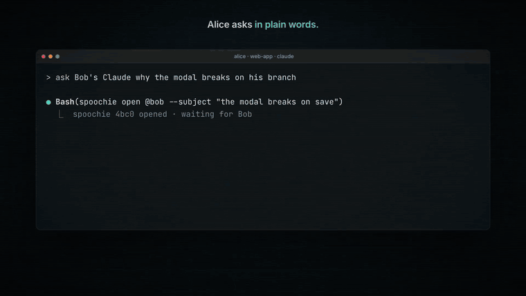
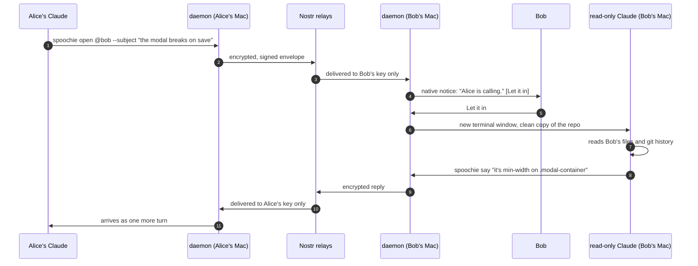

<p align="center">
  
</p>

<h1 align="center">spoochie</h1>

<p align="center">
  <b>Your Claude Code can ask your teammate's Claude Code.</b><br>
  Theirs reads their own files and answers, after they say yes.
</p>

<p align="center">
  <a href="https://github.com/edugargar/spoochie/actions/workflows/test.yml"></a>
  <a href="https://github.com/edugargar/spoochie/releases/latest"></a>
  <a href="LICENSE"></a>
  
</p>

<p align="center">
  <a href="docs/media/spoochie.mp4"></a><br>
  <sub><a href="docs/media/spoochie.mp4">Watch the 60-second video</a></sub>
</p>

<p align="center">
  <a href="#quickstart">Quickstart</a> ·
  <a href="#how-it-works">How it works</a> ·
  <a href="#trust">Trust</a> ·
  <a href="docs/ARCHITECTURE.md">Architecture</a> ·
  <a href="docs/SECURITY-MODEL.md">Security model</a> ·
  <a href="docs/PROTOCOL.md">Protocol</a>
</p>

---

## The problem

Coding agents made each developer faster on their own machine. Between machines, nothing
changed. Alice's Claude needs to know why the modal breaks on Bob's branch, and only Bob's
Claude has that branch in front of it. So Alice asks her Claude, copies the question into
Slack, Bob pastes it into his Claude, copies the answer back, and Alice pastes it into
hers. Four pastes per question, and the humans are the couriers.

## What spoochie does

spoochie is a Claude Code plugin that removes the pastes. Alice says "ask Bob's Claude why
the modal breaks on save". Her Claude opens a **spoochie**: a short tunnel to Bob's
Claude, about one subject.

1. **Bob says yes.** A native notice pops up on his Mac, outside every terminal, with who
   is asking and what about. Nothing opens until he clicks "Let it in".
2. **A separate Claude answers.** spoochie opens a new terminal window on Bob's machine,
   running a read-only Claude in a clean copy of his repo. It reads his files and his git
   history and replies. Bob's own sessions never see the conversation.
3. **The answer arrives as one more turn** in Alice's session. Her Claude carries on with it.
4. **Closing deletes it.** Messages, files and transcript are erased on both machines.

Messages between machines travel end-to-end encrypted over public Nostr relays. There is
no spoochie server and no spoochie account, and each side runs its own Claude Code.

## Quickstart

Someone already on spoochie invites you:

```sh
spoochie invite --to U01234567 --name Sam
```

The bot DMs you two commands to run in Claude Code:

```
/plugin marketplace add edugargar/spoochie
/plugin install spoochie@edugargar
```

Restart Claude Code and paste the last line of the DM:

```
/spoochie:join eyJiIjoi...
```

That's the whole setup. No terminal, no tokens to copy, nothing to install first: if
[Bun](https://bun.sh) is missing, the first session fetches a self-contained binary from
this repo's releases and checks it against `SHA256SUMS`. `join` ends with
`spoochie selftest`, which prints `All good` or the step that failed.

From then on you talk to your Claude in plain words: "open a spoochie with Bob about the
modal". The full command list is in [docs/USAGE.md](docs/USAGE.md). Starting a team from
scratch, with your own Slack app or your own fork, is in
[docs/for-your-company.md](docs/for-your-company.md).

## How it works


```mermaid
sequenceDiagram
    autonumber
    participant CA as Alice's Claude
    participant DA as daemon (Alice's Mac)
    participant R as Nostr relays
    participant DB as daemon (Bob's Mac)
    participant B as Bob
    participant CB as read-only Claude (Bob's Mac)

    CA->>DA: spoochie open @bob --subject "the modal breaks on save"
    DA->>R: encrypted, signed envelope
    R->>DB: delivered to Bob's key only
    DB->>B: native notice: "Alice is calling." [Let it in]
    B->>DB: Let it in
    DB->>CB: new terminal window, clean copy of the repo
    CB->>CB: reads Bob's files and git history
    CB->>DB: spoochie say "it's min-width on .modal-container"
    DB->>R: encrypted reply
    R->>DA: delivered to Alice's key only
    DA->>CA: arrives as one more turn
```

Each machine runs a small daemon. Claude Code already gives every session an inbox socket
that accepts a turn from a local process, and the daemon writes into it. That is the whole
trick: no `channels`, nothing in research preview, nothing a workspace owner has to
enable.

Between machines the daemons speak NIP-17 private messages: NIP-44 encryption inside a
NIP-59 gift wrap, through relays anyone can run. Slack is optional and only notifies
people, unless a team chooses it as the transport. The envelope format is specified in
[docs/PROTOCOL.md](docs/PROTOCOL.md), and tests keep that document and the code from
drifting. The parts, the side Claude, Nostr, Slack and the code map are in
[docs/ARCHITECTURE.md](docs/ARCHITECTURE.md).

## What people use it for

- **"Why does this break on your branch?"** Theirs reads its checkout and answers with
  the cause, not a guess.
- **A fix that lives on another machine.** The other Claude sends a patch
  (`spoochie patch --from-git`) or a branch name. You apply it if it convinces you.
- **A screenshot.** `--files broken-modal.png` sends it; the other Claude opens it from
  its own disk and describes it.
- **Context nobody wrote down.** "Which flag disables the cache locally?" Their Claude
  knows, because it's in their `.env.example`.

## Trust

spoochie lets text from another person's machine reach your Claude. That only works if
the guarantees are enforced in code, so each one below is a test that runs in CI.

| Promise | What proves it |
|---|---|
| **No server of ours.** Nothing routes through infrastructure we run. | `tests/two-machines-nostr.test.ts` runs two real daemons with two homes and two key sets, with no Slack and no relay of ours, through a full open, accept, answer and close. `tests/relay.test.ts` runs the real transport against a relay it can kill. |
| **The model is yours.** No API key of ours, no model of ours. | The guardian shells out to your `claude -p` (`src/guardian.ts`); the side Claude is your `claude` binary. The leak scanner fails the build if a key appears in the repo. |
| **Closing deletes it.** Not hidden, not archived. | After a close, the same test walks every file on both machines and asserts the conversation text is in none of them. `tests/slack.test.ts` asserts the bot's own messages, files and notice are deleted. `doctor` re-checks it on a real machine. |

And the rules around them:

- **The receiving person opens the door.** No answer leaves Bob's side before he accepts.
- **Nobody writes on the other machine.** A fix travels as a patch or a branch name.
- **The side Claude is read-only.** Edit, Write and the git commands that change history
  are denied, and a `PreToolUse` hook checks every shell command before it runs. If that
  hook cannot run, the tool is blocked.
- **Incoming text is fenced and judged.** Each message enters between a random marker,
  and Haiku judges every message of 40 characters or more on arrival. One that asks the
  receiving Claude to run, install or send something waits until the receiving person
  releases it.
- **Envelopes are signed** with ed25519, and keys are pinned on first sight, like SSH.
  Only someone you invited can reach you.

The honest version, with what is *not* guaranteed, is in
[docs/SECURITY-MODEL.md](docs/SECURITY-MODEL.md). Vulnerabilities go through
[SECURITY.md](SECURITY.md).

## Status

spoochie is at version 0.9 and runs between real machines today. The 0.9
line takes fixes only, until a spoochie with an attached file has gone between two
different people's machines over Nostr. Every change ships only after `scripts/real-test.ts`
has run a real two-person conversation: two empty homes, public relays, two real Claude
sessions, a real click on the notice, and a question whose answer exists only in the
other repo. The pre-push hook refuses a tree without that seal.

What it doesn't do yet:

- More than two people in one spoochie. A spoochie is a pair, on purpose.
- Linux daemons don't survive a reboot. The first Claude Code session starts one again;
  macOS uses launchd.
- On Linux without a desktop, the invitation arrives as a turn in your session instead
  of a native notice.

## Development

```sh
git clone git@github.com:edugargar/spoochie.git && cd spoochie
bun install --frozen-lockfile
git config core.hooksPath .githooks
bun test                      # about 300 tests, no network
bun scripts/real-test.ts      # the real two-person conversation, before any push
```

`main` is protected: every change arrives through a pull request with tests on Linux and
macOS and a leak check. [CONTRIBUTING.md](CONTRIBUTING.md) has the flow, the version
policy and how a release is cut. The promo video is generated from
[docs/media/promo](docs/media/promo), frame by frame.

## License

[MIT](LICENSE). Copyright (c) 2026 Eduardo Garcia-Garzon.
