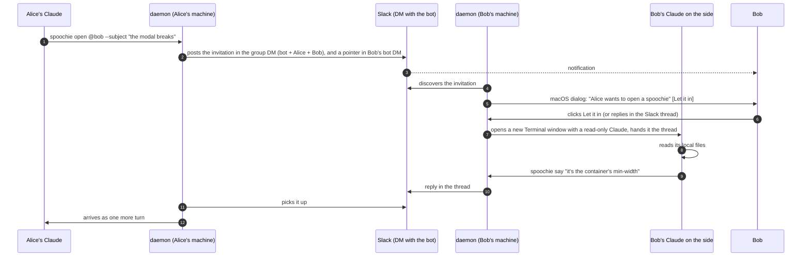
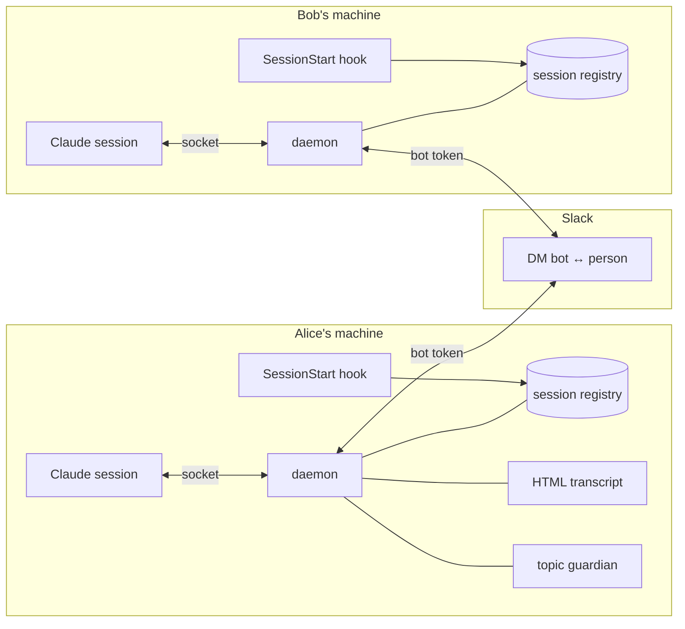

# Architecture

How spoochie moves a question from one Claude Code session to another, part by part. The wire format itself is in [PROTOCOL.md](PROTOCOL.md); the threat model is in [SECURITY-MODEL.md](SECURITY-MODEL.md).

## How it works



The underlying mechanism is small. Claude Code opens one inbox socket per session and
exports its path and a token:

```
CLAUDE_CODE_MESSAGING_SOCKET=/tmp/cc-socks/<pid>.sock
CLAUDE_CODE_MESSAGING_TOKEN=<token>
```

A local process writes two lines there and the text enters that session as a turn:

```json
{"type":"auth","token":"<token>"}
{"type":"user","message":{"role":"user","content":"..."}}
```

That's the whole thing. The format is not in the public docs: it comes from the Claude
Code binary itself, which prints it as a supported recipe for hooks and scripts. spoochie
does not use `channels`, so it depends on nothing in research preview and on no workspace
Owner enabling anything.



Parts:

- **`SessionStart` hook**: registers the session, starts the daemon and claims the
  spoochies that arrived while nobody was listening.
- **daemon, one per machine**: the only thing alive between turns, so it keeps the clocks
  and routes. A Claude can't hold a timer; it only exists while it thinks. On macOS it
  runs under launchd and writes a heartbeat every 20 s that `doctor` measures.
- **Nostr bridge**: the transport between machines since 0.9: end-to-end encrypted
  private messages through public relays, no server of ours.
- **Slack bridge**: notifications, and the transport for people without a Nostr key or
  teams that choose it.
- **guardian**: on the receiving side, Haiku reads every incoming message. Off-topic
  gets a label; a message that asks the receiving Claude to act is held until the
  receiving human releases it.
- **transcript**: one HTML file per thread, ready to publish as an Artifact.
- **`SessionEnd` hook**: closing the window closes your live spoochies.
- **the Claude on the side**: one Claude per accepted spoochie, in a new terminal window,
  read-only, in the repo that matters, so your own session stays yours.
- **`UserPromptSubmit` hook**: touches your session record, so the daemon knows which
  terminal you are actually working in and delivers the invitation there.

## The Claude on the side

A spoochie that lands in the session you are working in smears someone else's
conversation over your screen. So it never does. On macOS an incoming spoochie is a
**system dialog**, outside every terminal, with the spoochie dog on it: who is asking, the
subject, the question, and three buttons. "Let it in" accepts; "Not now" closes the
tunnel as rejected; "Open in Slack" opens the thread, where replying also accepts. Your
open sessions see nothing at all, before or after.

Once you accept, the daemon opens a **new terminal window** running a Claude of its own
on a **clean copy of the repo** (a `git worktree` of HEAD, shared objects, seconds to
make), hands it the thread, and every later turn goes there. Your checkout is never the
working directory of that Claude, so even something that slipped past its tool list
could not touch your files. The price: what isn't committed (`.env`, local edits) isn't
in the copy, and the side Claude says so when asked. `spoochie config --copy off`
makes it work in the real checkout instead. You watch it
work in that window and can type to it. It can read the repo and run read-only git; it
cannot write files, cannot accept or release anything. Closing the window closes the
spoochie.

Which repo, in order: the open session whose checkout has the branch in the envelope;
the one whose directory name appears in the subject or the first message; otherwise the
one you typed in most recently. That session only lends its directory. If it picked
wrong, `spoochie take <id>` from the right session moves it. Accepting twice, or taking
it from the same repo, never opens a second window.

Without a desktop (Linux servers, `SPOOCHIE_NOTICE=terminal`) the invitation is delivered
into that session as a turn instead, and its Claude asks you.

- The window runs in Claude Code's `auto` permission mode: the read-only allowlist is
  approved outright, anything else is judged by Claude Code's own classifier instead of
  stopping to ask, and Edit, Write, `git push`, `git commit`, `git checkout`, `git reset`
  and `rm` are denied outright, which no mode can override. `SPOOCHIE_ASIDE_PERMISSIONS=default`
  in the daemon's environment makes it ask for everything again.
- On macOS the window is Terminal.app, opened with `open`, which needs no permissions.
  Anywhere a window cannot be opened (Linux without a desktop, `SPOOCHIE_WINDOW=background`)
  the side Claude runs headless as `claude -p`, with its output in
  `~/.claude/spoochie/aparte/<id>.log`.
- `--here` on `accept` or `take` keeps the old behaviour: that session answers itself.
- `spoochie config --aside off` turns the side Claude off for good.
- Where it runs is posted in the Slack thread, not in your terminals.

## Nostr: no server, your keys, encrypted, deleted

Since 0.9, the conversation between two machines travels over [Nostr](https://nostr.com)
by default, and Slack is the notifier. There is no server of ours and no account for
anyone: each person gets a secp256k1 key pair at join (in `~/.claude/spoochie/config.json`,
mode 0600), and messages go through public relays that already exist. Anyone can run
one; each person picks theirs (`spoochie nostr --relays wss://a,wss://b`; three free
public relays by default).

What a relay sees: an event of kind 1059 addressed to a public key, signed by a random
one-time key, with a randomised timestamp. Nothing else. Inside, the message is a NIP-17
private message: the text in `content`, the subject in a `subject` tag (so a Nostr client
on your phone shows it readable), spoochie's envelope in an `sp` tag, sealed and signed
by the sender (kind 13) and gift-wrapped for the receiver (kind 1059) with NIP-44
encryption. Only the receiver's key opens it. When the spoochie closes, each side asks the
relays to delete every event it published (NIP-09, signed with the one-time key it kept),
and deletes locally as described above.

Who can reach you: only someone whose key is in your contacts, which is what the
invitation puts there. A perfectly formed envelope from an unknown key is dropped
without opening a tunnel. The invitation carries the inviter's key and relays; when the
newcomer joins, their daemon sends a hello with their key back over Nostr, and the two
can talk. People who were already on spoochie by Slack exchange keys automatically: each
daemon sends its key by Slack DM once to every contact that has none, and the other
daemon answers with its own. Nothing to re-join.

Slack keeps its job as the place that notifies you: when someone opens a spoochie with
you over Nostr, the bot DMs you one line pointing to the dialog on your Mac. The thread
itself is not in Slack. `spoochie config --transport slack` puts threads back in Slack
for everyone; contacts without a Nostr key use Slack regardless.

Files (screenshots, logs) travel too, since 0.9.2: each file goes in 20 KB chunks, one
encrypted envelope per chunk, and the other daemon reassembles it in its own spool and
announces the local path, exactly as the Slack bridge does. The relay sees neither the
name nor the bytes. The 10 MB cap is the same as over Slack; a 500 KB screenshot is 25
envelopes. Chunks that arrive before the invitation wait in the spool until it does.

Tested against real relays (publish, receive, decrypt, delete) and with two real daemons
talking through a shared directory that stands in for the relays, with the whole
lifecycle and a check that no plaintext ever touches the "relay".

## Slack, inside

Two places, two jobs. The **DM between the bot and each person** is the mailbox: it is
the one channel each machine polls for what arrives. The **thread of each spoochie**
lives, by default, in a **group DM with the bot, you and the other person**, so both of
you see the whole conversation in Slack. (The first version kept the thread in the
receiver's bot DM, and the person who opened it never saw it in Slack.) When you open a
spoochie, the daemon posts the invitation in that group and drops the same invitation in
the receiver's bot DM with a pointer to the group; their daemon follows the pointer and
polls the group thread from then on.

`spoochie config --threads` picks where threads live:

- `group` (default): a group DM per pair. Private to the two of you. Needs `mpim:write`,
  `mpim:read` and `mpim:history` on the bot; without them the daemon says so once and
  falls back to `dm`.
- `channel --channel C0…`: one channel for every spoochie of the team. Everyone in the channel
  sees everything, which may be the point. Invite the bot to the channel.
- `dm`: the receiver's bot DM only. The opener sees replies in their terminal, not in Slack.

Bot scopes for the normal path: `chat:write`, `im:write`, `im:read`, `im:history`, plus
the three `mpim:*` above for group threads. `docs/slack-app-manifest.yml` is the whole
app, ready to paste into "Create app from manifest", so nobody edits scopes by hand. `spoochie invite --to` resolves the newcomer
on the inviter's side, and the invitation carries both ids, so nobody is looked up in
Slack afterwards. `users:read` and `users:read.email` are only needed to invite by email
or by name, and for `@someone` who isn't in your local contacts. No user token is needed
for anything. Both machines need 0.7.1 or later for group threads: an older receiver
ignores the pointer and answers in its DM.

Alternatives I tried and dropped, with the measurement:

- **Socket Mode**: with several connections from the same app, Slack delivers each event
  to ONE of them. A spoochie for Bob could be grabbed by Alice's daemon.
- **Walking your DMs looking for the header**: the first version, and it fell over on the
  first real account. 197 DMs, `conversations.history` is Tier 3, and Slack returned
  `ratelimited` on the second channel.

`conversations.replies` and `conversations.history` are Tier 3: about 50 per minute **per
method and per app**, shared by the whole team. So each daemon caps itself: at most 4
threads per tick, round-robin, and the inbox poll adapts to the team size (your contacts
plus you) so that discovery never uses more than 25 `history` calls a minute in total:
every 5 s for up to 2 people, 10 s for 4, 36 s for 15, 60 s for 25. An invitation shows
up within one poll. For 15 people with two conversations at once that's 25 `history` and
24 `replies` calls per minute. On a 429, `Retry-After` is honoured and everything stops.

## Screenshots and files

`--files a.png,b.diff` on `open` or `say`. Within one machine they travel as absolute
paths and the Claude across opens them under its permissions. Across machines the bot
uploads them to the thread and the daemon on the other side downloads them to its own
spool, so what that session receives is a path that exists on **its** disk. 10 MB cap:
spoochie is for clues, not for moving binaries.

## A spoochie is a call, not an archive

When a spoochie closes, the conversation is deleted: locally only the envelope stays
(id, subject, who, when, why it closed) so `list` still works and the same id can't be
reused; the messages, the downloaded files and the HTML transcript go. In Slack, 45 s
later (enough for the other daemon to read the close), everything the bot posted goes
too: the thread, its files, and the pointer in the receiver's DM. What a person typed by
hand stays, because the bot can't delete it. The knowledge lives on in the Claude that
had the conversation: the asking session keeps every answer in its context and carries
on. `spoochie config --erase off` keeps conversations instead.

Closing also reaches the other machine now: the close travels as its own envelope kind
and the other daemon closes (and deletes) at once, instead of finding out by silence
ten minutes later.

## The transcript

Off by default, and we turned it off for ourselves too: the Slack thread already is the
shared record, and publishing costs the opener's session one Artifact call per turn. The
HTML file in `~/.claude/spoochie/transcripts/` is written regardless, for free, and
`spoochie show <id>` reads the thread. If you turn it on, it republishes itself. The daemon keeps the HTML current but can't publish an Artifact,
which is a tool of the Claude session, so the republish request rides along with the turn
that session is already receiving. For a spoochie you open, your session publishes it.
For one that arrives, the Claude on the side publishes it from its window, so your
working session never sees the request and the link still shows up in the Slack thread.

## Code map

`SPOOCHIE_HOME` isolates all state. It's needed because `os.homedir()` in Bun does **not**
honour `$HOME`, so isolating tests by `HOME` doesn't work: they wrote into the real
`~/.claude`.

```
src/
  cli.ts        the commands
  daemon.ts     clocks, routing, delivery
  slack.ts      the bridge: discovery, threads, call budget
  threads.ts    the envelope, the fence, the limits
  outbox.ts     merges consecutive messages before publishing
  join.ts       builds and reads invitations
  signing.ts    ed25519 signatures, keys pinned on first sight
  guardian.ts   the receiving-side judge
  startup.ts    how the daemon starts: launchd, heartbeat, compiled or not
  aside.ts      the Claude on the side: what it may run, its first turn
  selftest.ts   the whole loop, locally
  doctor.ts     what has to be right
commands/       /spoochie and /spoochie:join
hooks/          SessionStart (fetches and verifies the binary if Bun is missing),
                UserPromptSubmit (marks the session you are typing in) and SessionEnd
bin/spoochie     runs the verified binary of this version, or Bun over the source
scripts/        assistants for the things only a person can do
```

Releases: `bun scripts/version.ts X.Y.Z "what changed"` sets the version in the three
manifests and opens the `CHANGELOG.md` entry (a test fails if they disagree); pushing the
`vX.Y.Z` tag runs the tests and attaches one self-contained binary per platform
(`bun build --compile`) plus `SHA256SUMS` to the GitHub release. That is what the hook
downloads. Every push to `main` runs the suite on Linux and macOS. The daemon checks the
latest release every 6 hours and mentions a newer one once in the thread; `spoochie
doctor` shows it too. Outgoing messages are queued on disk (`~/.claude/spoochie/outbox.json`),
so a daemon restart mid-conversation loses nothing, and failed publishes retry every minute.

Manual install without the plugin:
`hooks/session-start.sh` and `hooks/session-end.sh` do the same as `hooks/hooks.json`,
for wiring from your `~/.claude/settings.json`.
